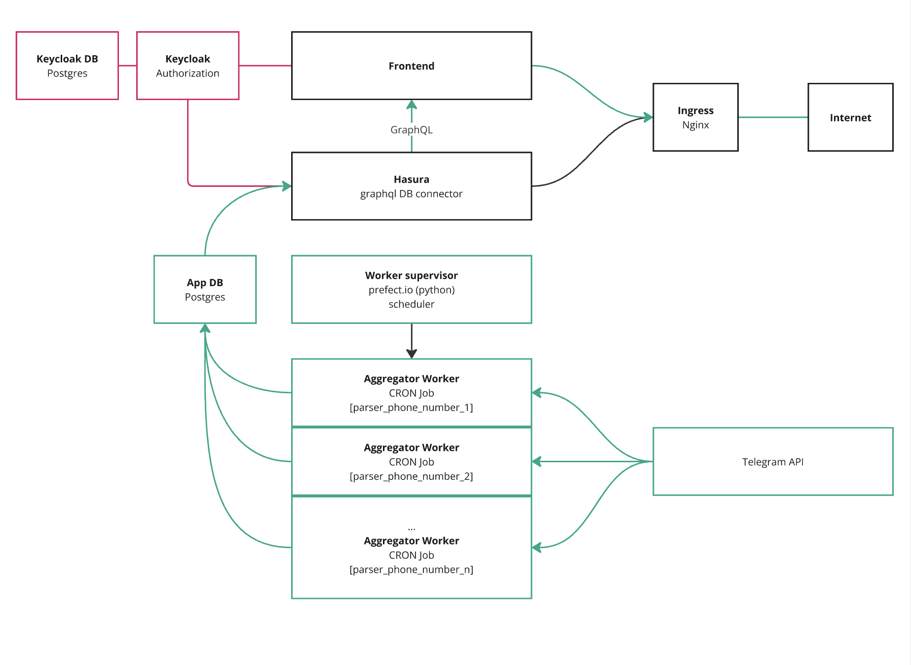

# ansible

Развернуть окружение на свежую VPS

```sh
cd ansible/vps && ansible-playbook -i inventory/hosts.ini playbook.yml --ask-pass -vvv
```

# Архитектура микросервисов



# Как локально развернуть проект в dev окружении

Требования к локальной машине:

- mac/linux (разработка под windows не велась, разворачивать на свое усмотрение)
- docker 27.0.3^
- hasura CLI https://hasura.io/docs/2.0/hasura-cli/install-hasura-cli/
- ansible 2.17.3^

1. Создать рабочий каталог, например `godigital`.

2. Склонировать в этот каталог репозитории

- `git clone git@github.com:Gaever/gaever-godigital-infra.git ./godigital-infra`
- `git clone git@github.com:Gaever/gaever-godigital-frontend.git ./godigital-frontend`
- `git clone git@github.com:jackvizo/godigital-tgstat-bot.git ./godigital-tgstat-bot`
- `git clone git@github.com:Gaever/gaever-godigital-tests.git ./godigital-tests`
- `git clone git@github.com:Gaever/gaever-godigital-keycloak-theme.git ./godigital-keycloak-theme`

3. Создать .env.dev файл:

```sh
cd godigital-infra/ && cp .env.dev.example .env.dev
```

4. Сгенерировать .env файлы для всех проектов

```sh
yarn env:dev
```

5. В файле /etc/hosts добавить строки

```sh
127.0.0.1 godigital.local
127.0.0.1 sso.godigital.local
```

5. Запустить docker контейнеры

```sh
cd godigital-infra/docker/godigital-docker
docker compose up -d
```

6. Расположение сервисов
   - Фронтенд: http://godigital.local:3000/
   - keycloak: http://sso.godigital.local:3000/
   - hasura: http://localhost:8080/
   - prefect: http://localhost:4200/

# Как править SQL запросы

Выборка статистики из БД выполняется двумя способами:

1. Через GraphQL запрос к hasura (для простых запросов). Пример:

```graphql
query ER24($tg_channel_ids: [bigint!]!, $date: timestamp!) {
  stat_post_info(
    where: { tg_channel_id: { _in: $tg_channel_ids }, date_of_post: { _lte: $date } }
    order_by: { date_of_post: desc }
    limit: 1
  ) {
    views
    view_24h
  }
}
```

В консоли hasura http://localhost:8080/ представлен визуальный редактор, в котором можно собрать graphql запрос.

Чтобы авторизованному пользователю были доступны только данные (и недоступны чужие), hasura предоставляет механизм прав и ролей.
Права и роли настраиваются в веб-консоли http://localhost:8080/

Документация сервиса:
https://hasura.io/docs/2.0/auth/authorization/permissions/
(интерфейс, который отображен в документации можно увидеть перейдя в консоли http://localhost:8080/ в раздел "Data", и выбрав в дереве базу данных)

2. С помощью хранимых процедур (для сложных запросов, вроде когортного анализа), которые также обёрнуты в graphql эндпоинты.
   Пример:

```sql
CREATE OR REPLACE FUNCTION public.unsubscribes_by_links(hasura_session json, start_date timestamp without time zone, end_date timestamp without time zone, tg_channel_ids bigint[], link_array text[])
  RETURNS SETOF fn_unsubscribes_by_links
  LANGUAGE plpgsql
  STABLE
  AS $function$
DECLARE
  x_hasura_user_id uuid;
BEGIN
  x_hasura_user_id := hasura_session ->> 'x-hasura-user-id';
  PERFORM
    public.check_user_access(x_hasura_user_id, tg_channel_ids);
  RETURN QUERY WITH link_prefixes AS (
    SELECT
    LEFT (unnest(link_array),
      22) AS link_prefix
),
filtered_users AS (
  SELECT
    tg_channel_id,
    invite_link,
    COUNT(
      CASE WHEN joined_at BETWEEN start_date AND end_date THEN
        1
      END) AS joined_count,
    COUNT(
      CASE WHEN left_at BETWEEN start_date AND end_date THEN
        1
      END) AS left_count
  FROM
    stat_user,
    link_prefixes
  WHERE
    tg_channel_id = ANY (tg_channel_ids)
    AND
    LEFT (invite_link,
      22) = link_prefixes.link_prefix
  GROUP BY
    tg_channel_id,
    invite_link
)
SELECT
  f.invite_link,
  COALESCE(f.joined_count, 0) AS joined_count,
  COALESCE(f.left_count, 0) AS left_count
FROM
  filtered_users f
GROUP BY
  f.invite_link,
  f.joined_count,
  f.left_count;
END;
$function$

```

Хранимая процедура вызывается hasura при обращении по соответствующему graphql запросу, например

```graphql
query UnsubscribesByLinks(
  $end_date: timestamp!
  $link_array: _text!
  $start_date: timestamp!
  $tg_channel_ids: _int8!
) {
  unsubscribes_by_links(
    args: { end_date: $end_date, link_array: $link_array, start_date: $start_date, tg_channel_ids: $tg_channel_ids }
  ) {
    invite_link
    joined_count
    left_count
  }
}
```

Процедура также проверяет наличие прав у авторизованного пользователя с помощью внутреннего вызова `check_user_access`.
Функция `check_user_access` определена в миграции `godigital-infra/hasura/migrations/default/1718171426406_functions/up.sql`

## Миграции

NB: в настоящее время миграции выполняются средствами prisma и hasura. Следует рассмотреть в будущем единый механизм миграций

Чтобы внести изменения в существующую процедуру, следует создать миграцию средствами hasura https://hasura.io/docs/2.0/hasura-cli/commands/hasura_migrate_create/

```sh
cd godigital-infra/hasura && hasura migrate create [migration-name]
```

В созданный файл миграции внести изменения.
Применить миграцию https://hasura.io/docs/2.0/hasura-cli/commands/hasura_migrate_apply/

```sh
cd godigital-infra && yarn hasura:apply
```

Изменения в схему БД следует производить в файле `godigital-infra/db/prisma/schema.prisma`.
После внесения изменений в файл, следует выполнить миграцию локально

```sh
cd godigital-infra && db:migrate:dev
```

# Как добавить новую хранимую процедуру

https://hasura.io/docs/2.0/schema/postgres/custom-functions/

Чтобы хранимую процедуру можно было использовать в связке с graphql эндпоинтом, необходимо оформить ее определенным образом.

1. Нужно создать пустую таблицу с колонками, которые возвращает процедура
   https://hasura.io/docs/2.0/schema/postgres/custom-functions/#pg-supported-sql-functions

2. Добавить в тело процедуры `check_user_access` (см. существующие процедуры)

3. Добавить таблицу и процедуру в отслеживаемые сущности в консоли hasura (https://hasura.io/docs/2.0/schema/postgres/custom-functions/#pg-track-custom-sql-functions), а также назначить им права доступа (в том же интерфейсе)

# Как задеплоить в прод

1. Если были внесены изменения через hasura консоль (например добавлены или изменены хранимые процедуры), следует локально экспортировать метаданные в git

```sh
cd godigital-infra && yarn hasura:export
```

3. Закомитить все актуальные изменения в проектах в `main` ветках
4. Добавить свой ssh ключ на сервер 46.8.52.236 (пароль получить у тимлида)
5. Содать в каталоге `godigital-infra` файл `.env.production`. Содержимое получить у тимлида.
6. На локальной машине выполнить

```sh
cd godigital-infra && yarn deploy:production
```

N.B! Команда не выполнит миграции и не применит метаданные hasura
Если были внесены изменения в хранимые процедуры или в права доступа, следует, после выполнения `yarn deploy:production` сделать следующее:

```sh
ssh deployuser@46.8.52.236

# на удаленной машине:
cd godigital-infra
yarn hasura:apply
```

Если также были внесены изменения в схему БД:

```sh
yarn db:migrate:production
```

# Как получить деперсонифицированный дамп production БД

На локальной машине, в файле `.env.dev`

Прописать production реквизиты от БД (yandex cloud) (взять у тимлида).

```sh
PROD_DB_HOST=
PROD_DB_PORT=
PROD_DB_USER=
PROD_DB_PASSWORD=
PROD_DB_NAME=
```

Убедиться, что подняты docker контейнеры.

Выполнить скрипт

```sh
cd godigital-infra && yarn db:prepare-stage
```

Внимание! Данные в локальной БД будут заменены данными из production дампа.
Деперсонифицированный дамп можно найти по пути `godigital-infra/db/prepare-stage/local_dump.sql`
Из дампа удалены авторизации в tg ботов.
